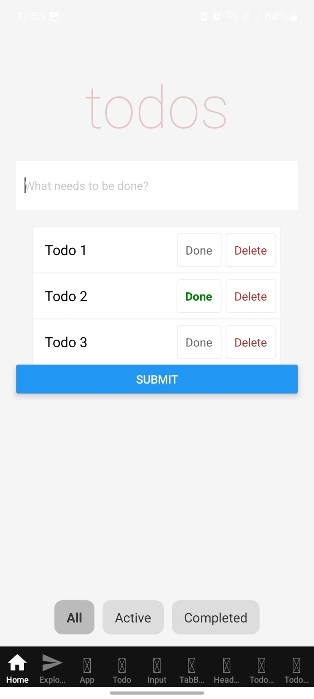
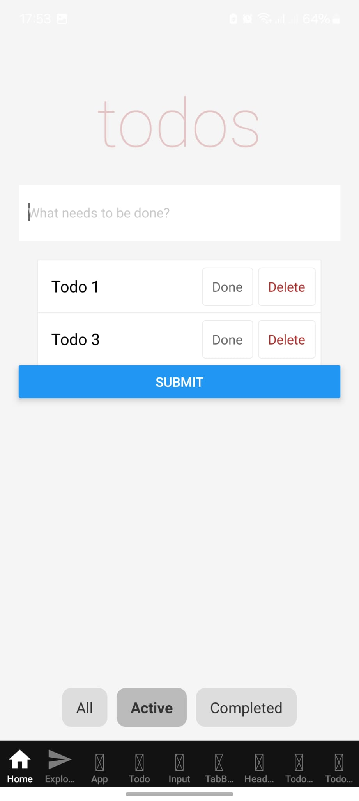
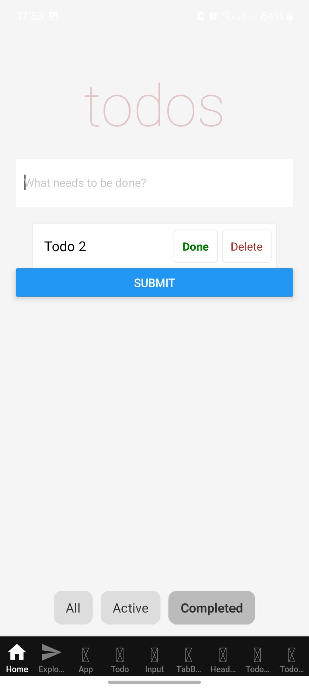

## Input
The application receives input through a text field rendered within each tab screen in a React Native app using Expo Router. When the user types in the field, the inputChange() function is triggered, updating the inputValue in the component's state using this.setState({ inputValue }). This maintains two-way binding, ensuring the input field reflects the most recent state.

## Procedure
The app is structured with a bottom tab navigator, where each screen—All, Active, and Completed—represents a filtered view of the to-do list. The logic for handling todos is encapsulated in a shared component (TodoScreen) used by each tab.
When the user presses the Submit button, the submitTodo() function appends a new task object (with title, todoIndex, and complete status) to the todos array in the component’s state.
deleteTodo() removes a task from the list based on its index.
toggleComplete() toggles the complete status of a task.

Each tab (screen) filters this list based on its route prop (filterType) to show:
All: all tasks,
Active: only incomplete tasks,
Completed: only finished tasks.
The layout uses ScrollView to manage overflow and ensures smooth scrolling, and React Native's props system is used to pass state and functions to child components (Input, TodoList, etc.).

## Output
The UI dynamically reflects the current state of the todos array. Each screen displays a filtered list of tasks, updating in real time as users add, complete, or delete items. State changes automatically trigger re-rendering, ensuring the displayed list remains in sync with user interactions.

